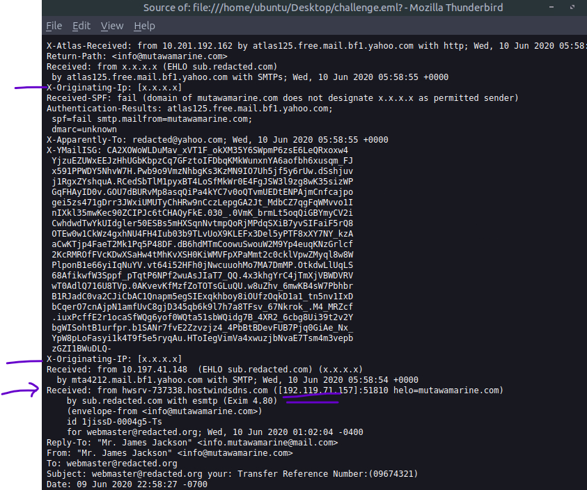
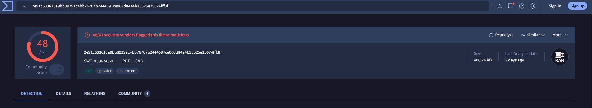

```
Room         : The Greenholt Phish
Platform     : TryHackMe
Difficulty   : Easy
Date         : 22/06/2026
Author       : Amir Shahrir
Tools Used   : Linux Terminal, SPF Surveyor, DMARC Domain Checker, VirusTotal
Status       : Completed
```

---

### Executive Summary

This exercise involved the investigation of a suspected phishing email received in a simulated corporate inbox. Raw email headers were examined to trace the message's true origin and assess the sending domain's authentication posture through SPF and DMARC record lookups. An attachment included in the email was extracted, its SHA-256 hash computed, and the hash cross-referenced against VirusTotal to confirm its malicious classification. The investigation identified multiple indicators consistent with a spoofed phishing attempt, reinforcing skills directly applicable to phishing triage in a SOC environment.

---

### Objectives

- Analyze the provided email to identify and extract key artifacts
- Investigate the message source to determine its origin and authenticity
- Use analysis tools to assess the potential maliciousness of the email

---

### Environment & Tools

| Component | Details                                                               |
| --------- | --------------------------------------------------------------------- |
| Platform  | TryHackMe in-browser VM (Ubuntu)                                      |
| Tools     | Linux Terminal, whois, SPF Surveyor, DMARC Domain Checker, Virustotal |

---

### Methodology

#### Phase 1 — Email Header Analysis

The investigation began by opening the suspicious email in the lab environment and accessing the Message Source — a raw view of the complete email including all headers, routing information, and metadata not visible in the standard email client view.

The Received: headers were examined to reconstruct the email's delivery path. Email headers are stamped in reverse chronological order — each mail server prepends its own Received: entry as the message passes through. This means the topmost Received: header reflects the most recent hop (the recipient's mail server), while the bottommost entry reflects the first hop from the sender's originating infrastructure. The X-Originating-IP field was located at the bottom of the header chain, revealing the true source IP address of [PLACEHOLDER — originating IP].

Additional header fields extracted included the From:, Reply-To:, and Return-Path: addresses. A discrepancy between these fields — a common phishing indicator — was noted, as legitimate senders typically align all three.



#### Phase 2 — Domain Authentication Assessment

The sending domain was extracted from the From: header for authentication record analysis.

SPF (Sender Policy Framework) was checked using SPF Surveyor. SPF is a DNS record that specifies which mail servers are authorised to send email on behalf of a domain. The lookup returned the domain's full SPF record, which was reviewed to determine whether the originating IP fell within the authorised sending range.

DMARC (Domain-based Message Authentication, Reporting & Conformance) was checked using DMARC Domain Checker. DMARC builds on SPF and DKIM to instruct receiving mail servers on how to handle messages that fail authentication — reject, quarantine, or take no action. The policy record for the sending domain was retrieved and assessed.

#### Phase 3 — Attachment Analysis

An attachment was present in the phishing email. Rather than opening it, the file was downloaded to the VM and its SHA-256 cryptographic hash was computed from the command line.

```bash
sha256sum [filename]
```

The resulting hash was submitted to VirusTotal, a multi-engine threat intelligence platform that compares file hashes and content against dozens of antivirus and malware detection engines. The lookup returned a positive detection result, confirming the file was flagged as malicious.



---

### Lessons Learned

- Email headers are read bottom-up for origin tracing. The Received: headers are prepended as the email passes through each server, so the topmost entry is the last hop and the bottommost reflects the true originating server. The X-Originating-IP field at the bottom of the header chain was the key artifact — not the headers visible at the top of the source.

- SPF and DMARC are authentication mechanisms, not spam filters. SPF validates whether the sending server is authorised for the domain; DMARC dictates what happens when that check fails. Understanding both is essential for assessing why a phishing email might have bypassed a mail gateway — a weak or permissive DMARC policy is often the answer.

- Hash submission to VirusTotal is safer than file upload during triage.

-The tools used here — SPF Surveyor, DMARC Domain Checker, VirusTotal, and Whois — are OSINT resources. They query publicly available data: DNS records, domain registration information, and crowd-sourced threat intelligence.

---

_Write-up by Amir Shahrir | https://github.com/amirshahrir | Completed: [22/06/2026]_
_Note: This write-up is for educational purposes. All activities were conducted in an isolated, legal lab environment provided by TryHackMe._

```

```
