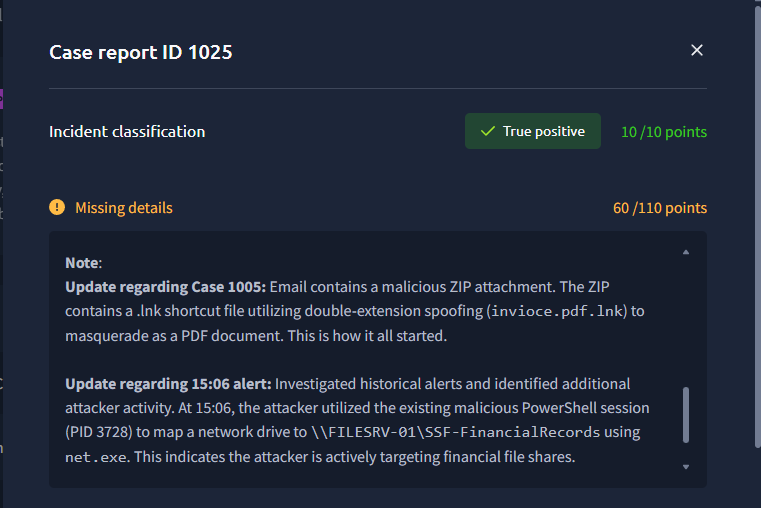
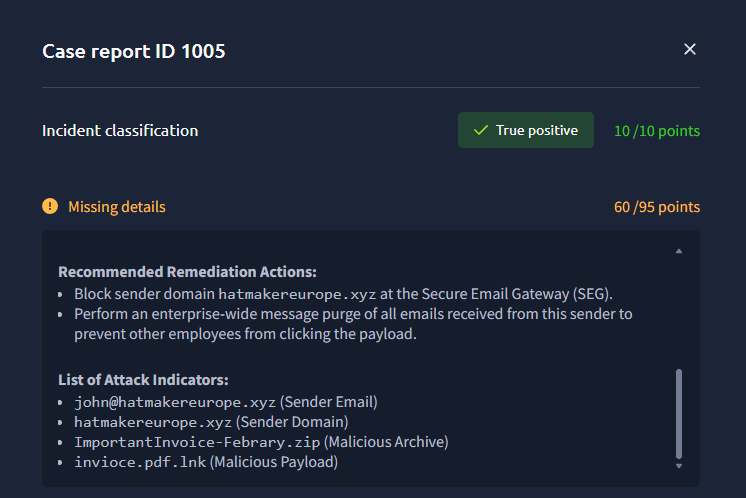
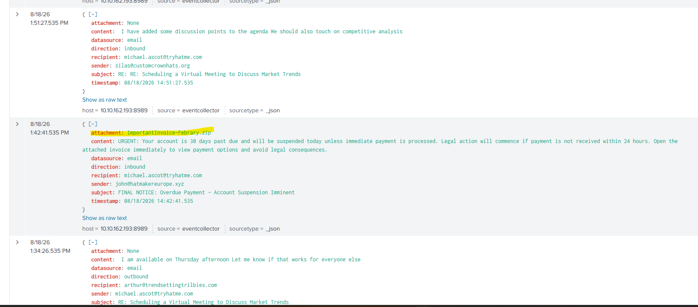
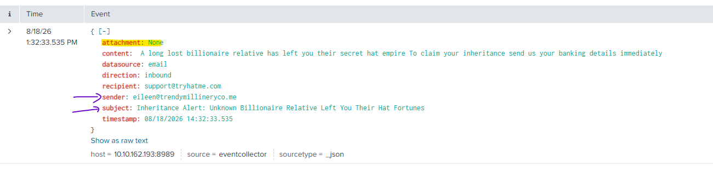

# TryHackMe SOC Simulator — Phishing Unfolding

**Room:** Phishing Unfolding (SOC Simulator)

**Date of activity:** 18 August 2026

**Role:** SOC Analyst L1

**Alerts triaged:** 35 total (Low / Medium / High severity)

---

## 1. Incident Summary

Multi-stage phishing intrusion beginning with a spoofed invoice email and progressing to targeted access of a financial file share via a malicious PowerShell session. Confirmed **True Positive**. The majority of Low-severity alerts in the queue were unrelated False Positives; a small number were correctly linked to this intrusion.

## 2. Detection

- **Case 1005** (Low severity) — "patient zero" alert on an inbound phishing email with a suspicious attachment. Confirmed True Positive.
- **Case 1025** (High severity) — escalation triggered by activity chained back to Case 1005. Confirmed True Positive.
- A subset of Low-severity alerts flagged for **suspicious parent-child process relationship** — confirmed True Positive, consistent with the LNK-to-PowerShell execution chain below.

## 3. Investigation Timeline

| Time (18 Aug 2026) | Event                                                                                                                                                                                                                                                    |
| ------------------ | -------------------------------------------------------------------------------------------------------------------------------------------------------------------------------------------------------------------------------------------------------- |
| 13:42:41           | Phishing email received by `michael.ascot@tryhatme.com` from `john@hatmakereurope.xyz`. Subject: _"FINAL NOTICE: Overdue Payment – Account Suspension Imminent"_ — urgency/deadline social engineering lure. Attachment: `ImportantInvoice-Febrary.zip`. |
| (post-delivery)    | User opened the ZIP and executed the enclosed `invioce.pdf.lnk` — a shortcut file using double-extension spoofing to masquerade as a PDF. Execution spawned a malicious PowerShell session (PID 3728).                                                   |
| 15:06              | Attacker reused the existing PowerShell session (PID 3728) to map a network drive to `\\FILESRV-01\SSF-FinancialRecords` via `net.exe`, directly targeting the financial file share.                                                                     |

_Note: additional historical alerts tied to Case 1005 were identified during investigation and correlated to this chain rather than escalated individually — reducing alert fatigue on what was one incident, not several._

## 4. Evidence / IOCs

- Sender email: `john@hatmakereurope.xyz`
- Sender domain: `hatmakereurope.xyz`
- Malicious archive: `ImportantInvoice-Febrary.zip`
- Malicious payload: `invioce.pdf.lnk` (double-extension spoof)
- Malicious process: PowerShell, PID 3728
- Lateral target: `\\FILESRV-01\SSF-FinancialRecords` (accessed via `net.exe`)
- Victim account: `michael.ascot@tryhatme.com`
- Host: `10.10.162.193`

> **Gap:** exact PowerShell command line, reverse shell destination/C2, and DNS indicators referenced in the scenario objectives were not captured in the working notes — flagging rather than assuming.

## 5. MITRE ATT&CK Mapping

| Technique                                     | ID        | Evidence                                  |
| --------------------------------------------- | --------- | ----------------------------------------- |
| Phishing: Spearphishing Attachment            | T1566.001 | Initial email w/ ZIP attachment           |
| User Execution: Malicious File                | T1204.002 | User opens `.lnk` payload                 |
| Masquerading: Double File Extension           | T1036.007 | `invioce.pdf.lnk`                         |
| Command and Scripting Interpreter: PowerShell | T1059.001 | PID 3728 session                          |
| Remote Services: SMB/Windows Admin Shares     | T1021.002 | `net.exe` drive mapping                   |
| Network Share Discovery                       | T1135     | Targeting of `SSF-FinancialRecords` share |

## 6. Verdict

- **Classification:** True Positive — confirmed multi-stage intrusion, initial access through to targeted access of a financial share.
- **Confidence:** Medium — the technical chain is confirmed from case data; some indicators (C2/reverse shell specifics) weren't fully captured.
- **Contained:** Yes

## 7. Scope / Impact

- One confirmed compromised user (`michael.ascot`) via phishing.
- Attacker demonstrated clear intent to access financial records via the `SSF-FinancialRecords` share; full data exfiltration not confirmed in available notes.
- Of 35 total alerts triaged, the majority of Low-severity alerts were unrelated noise, correctly separated from this chain.

## 8. Recommendations

- Block sender domain `hatmakereurope.xyz` at the Secure Email Gateway.
- Enterprise-wide purge of all emails from this sender.
- Enforce attachment filtering for double-extension files (e.g. `*.pdf.lnk`) at the gateway/endpoint.
- Alert on/restrict `net.exe` drive-mapping activity to sensitive shares from non-admin hosts.
- Isolate/reimage the affected host and rotate credentials used during the session.
- Review SMB access logs on `\\FILESRV-01\SSF-FinancialRecords` for data staged or accessed beyond what's confirmed here.

---
**THM Summary URL:** https://tryhackme.com/soc-sim/public-summary/849555de73a6f3b40e0352db1165c463b44fcd68dbcda287cbb50a32e2f58660a24d444d5f8e23c4e6e9a81e0a44273c
---
